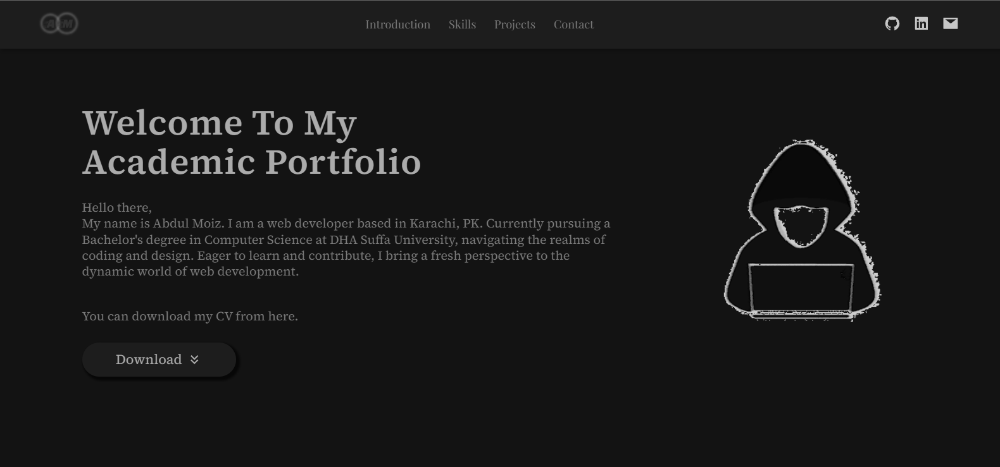

# Academic Portfolio
Designed and developed my personal academic portfolio using React.js and CSS.

## Live Website

Explore the Website [here](https://abdu1-moiz.netlify.app/).

## Technologies Used
- React.js
- HTML5
- CSS3
- Node.js

## Features
- Clean and modern design
- Responsive layout for seamless viewing on various devices
- Integration of React.js for dynamic and interactive user experiences

Feel free to explore the website and navigate through its pages. If you have any feedback or questions, don't hesitate to [contact me](mailto:shabdulmoiz96@gmail.com).

## How to Run Locally
1. Clone this repository: `git clone https://github.com/AbdulMoiz961/Academic-Portfolio.git`
2. Navigate to the project directory: `cd Academic-Portfolio`
3. Install dependencies: `npm install`
4. Start the development server: `npm run dev`

---

Happy Coding! 🚀
